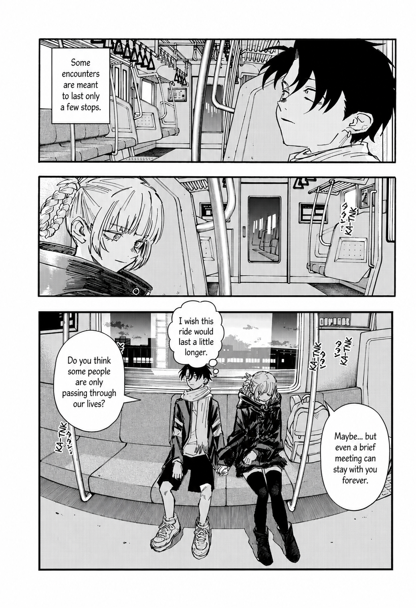
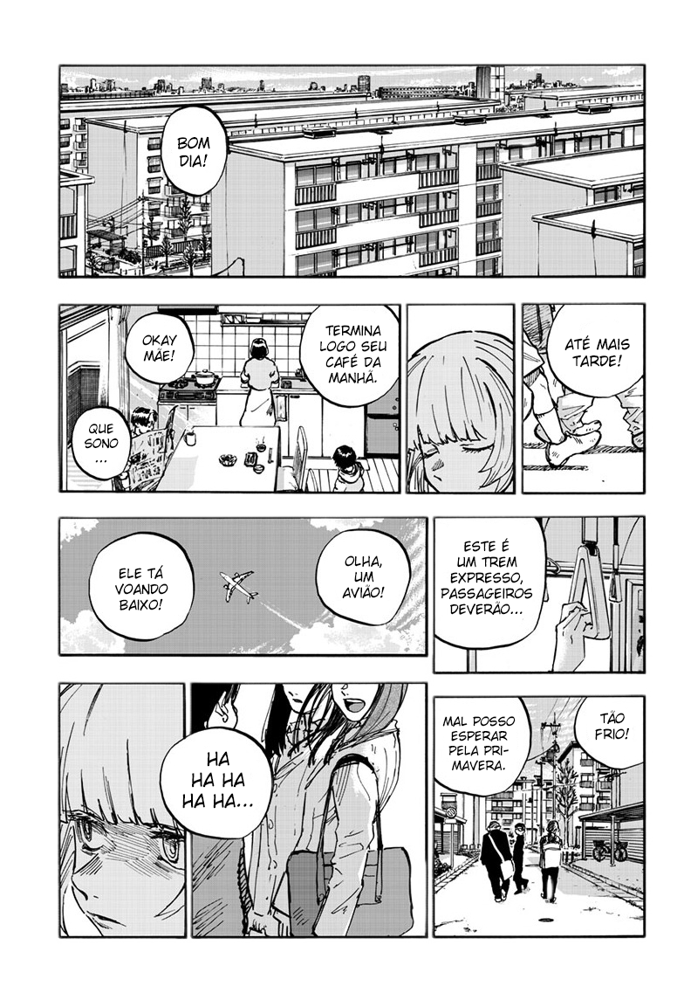
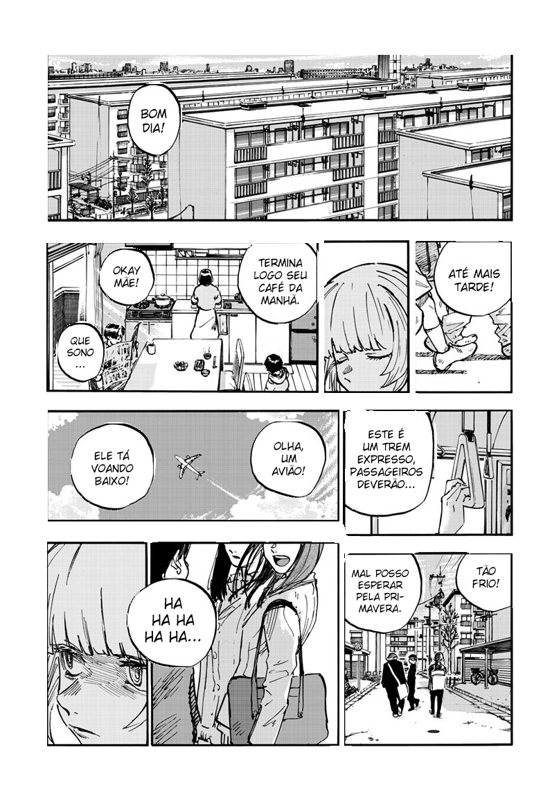
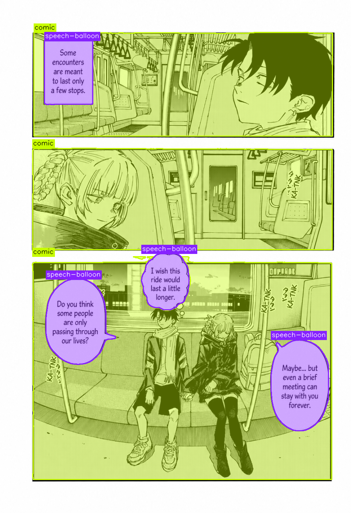
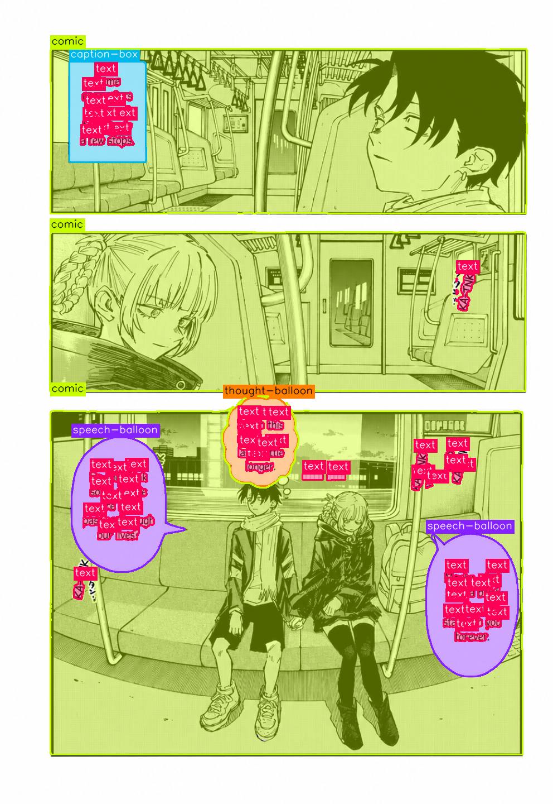
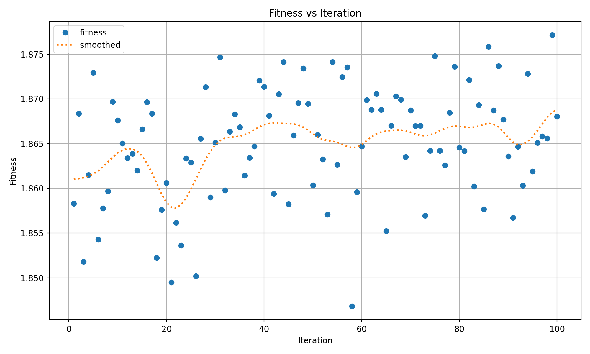
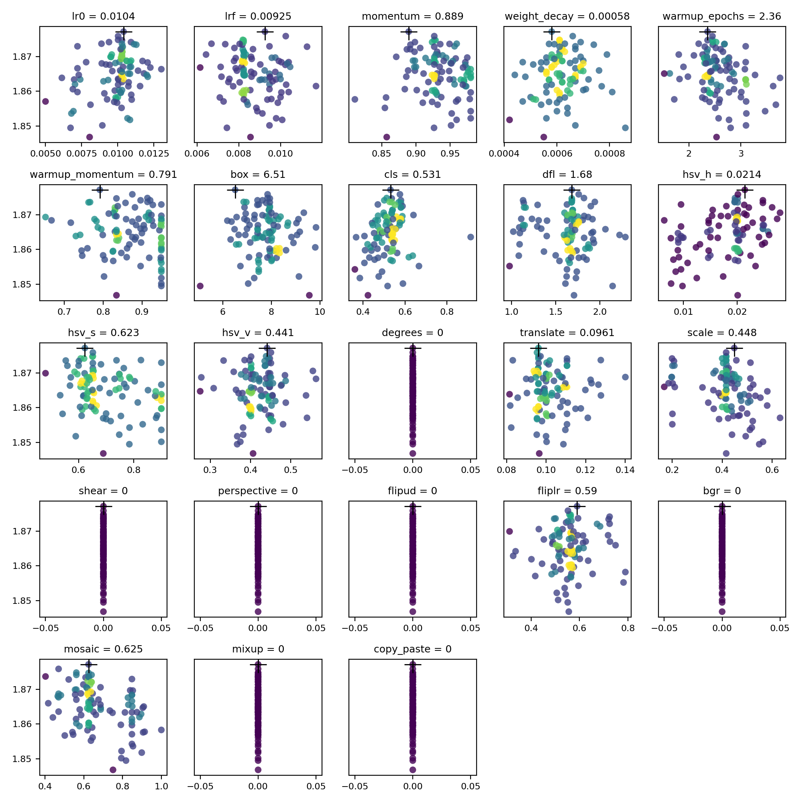

<div align="center">

# [ML] Manga Segment


</div>
<div align="left">

## 📃 | Description

Manga Segment is a [Python](https://www.python.org) computer-vision project for comic and manga page analysis. It trains and runs segmentation models to identify areas of interest such as panels, speech balloons, thought balloons, caption boxes, and text regions, then exports masks, overlays, segmented images, reports, and serving utilities for downstream processing.

The objective is automatic comic translation: segment the areas of interest where text is located, process and generalize those regions to remove the old text, and add the translation on top of the redrawn image.

This project was structured and tested with [U-Net](https://en.wikipedia.org/wiki/U-Net) and [Yolo](https://docs.ultralytics.com)(v8, v11, v26).

| Input | U-Net | YoloV8n (v0.1) | YoloV8s (v0.2) | YoloV11s (v0.2) | YoloV26s (v0.3) |
|--|--|--|--|--|--|
|  |  |  |  |  |  |

## Tune
| Model | Tuning Time | Image Size | Epochs/Inter | Iterations | Fitness | Scatter Plots |
|--|--|--|--|--|--|--|
| [YoloV8n](https://github.com/Ashu11-A/Manga-Segment/releases/tag/v0.1) (v0.1) | 45.1h | 1280x1280 | 100 | 100 |  |  |

## Dataset versions

### Images and annotations

| Property                     | v0.1                  | v0.2             | v0.3                                 |
|------------------------------|-----------------------|------------------|--------------------------------------|
| Images                       | 283                   | 480              | 754                                  |
| Train                        | 249                   | 420              | 660                                  |
| Valid                        | 22                    | 40               | 94                                   |
| Test                         | 12                    | 20               | 0                                    |
| Annotations                  | 3293                  | 4832             | 60419                                |
| Comic annotations            | 1258                  | 1938             | 3522                                 |
| Speech-balloon annotations   | 2035                  | 2894             | 4194                                 |
| Caption-box annotations      | ❌                    | ❌               | 283                                  |
| Thought-balloon annotations  | ❌                    | ❌               | 749                                  |
| Text annotations             | ❌                    | ❌               | 51671                                |

### Preprocessing and augmentations

| Property                     | v0.1                      | v0.2                                  | v0.3                                   |
|------------------------------|---------------------------|---------------------------------------|----------------------------------------|
| Auto-Orient                  | ✅                        | ✅                                    | ✅                                     |
| Grayscale                    | ✅                        | ✅                                    | ✅                                     |
| Resize                       | Stretch to 963x1400       | ⬜ Fit (white edges) in 963x1400      | Fit (white edges) in 992x1440          |
| Auto-Adjust Contrast         | Using Contrast Stretching | Using Contrast Stretching             | Using Contrast Stretching              |
| Crop                         | ❌                        | ❌                                    | 0% Minimum Zoom, 20% Maximum Zoom      |
| Shear                        | ❌                        | ❌                                    | ±10° Horizontal, ±10° Vertical         |
| Rotation                     | ❌                        | Between -15° and +15°                 | Between -15° and +15°                  |
| Exposure                     | ❌                        | Between -10% and +10%                 | ❌                                     |
| Flip                         | Horizontal, Vertical      | Horizontal, Vertical                  | ❌                                     |
| Blur                         | 0.5px                     | ⬆️ 1px                                | ❌                                     |
| Noise                        | 0.5%                      | 0.5%                                  | ❌                                     |


## Comparison (Unet vs YoloV8 vs YoloV11)

| Property         | Unet                | YoloV8 (v0.1)            | Yolov8s (v0.2)           | YoloV11 (v0.2)           |
|------------------|---------------------|--------------------------|--------------------------|--------------------------|
| Precision        | 0.7444              | 0.98424                  | 0.96524                  | 0.968                    |
| Recall           | ❌                  | 0.95234                  | 0.97068                  | 0.965                    |
| Val Seg Loss     | ❌                  | 0.7037                   | 0.65568                  | 0.69089                  |
| Val Clas Loss    | 0.23221             | 0.26816                  | 0.31534                  | 0.27078                  |
| Pretrained Model | ❌                  | Yolo Nano                | Yolo Small               | Yolo Small               |
| EarlyStopping    | 20                  | 100                      | 25                       | 25                       |
| Stop Epoch       | 26                  | 411                      | 169                      | 251                      |
| Image Set        | 3.882               | 283                      | 480                      | 480                      |
| Image Channels   | 4                   | 3                        | 3                        | 3                        |
| Training Size    | 512x768             | 1280²                    | 1400²                    | 1400²                    |
| Dropout          | 0.2                 | ❌                       | ❌                       | ❌                       |
| Kernel Size      | 3                   | 3                        | 3                        | 3                        |
| Filter           | [32,64,128,256,512] | [64,128,256,512,768]     | [64,128,256,512,768]     | [64,128,256,512,1024]    |
| Artifacts        | high                | low                      | low                      | low                      |

[Details about Yolov8](https://github.com/ultralytics/ultralytics/issues/189)
[Details about Yolov11](https://www.youtube.com/watch?v=L9Va7Y9UT8E)

## ⚠️ | Disclaimer

This project does not hold the copyright to any work used in connection with the training of its models. Any manga, comic, or other material attributed to the training process remains the property of its respective copyright holders, and no ownership over such works is claimed here. The author does not have the financial means to afford a lawsuit, and this material is shared in good faith.

This project was developed as part of a practical academic study and was built over the course of two years. It is intended for research and educational purposes only. If you are a rights holder and have concerns about any content, please open an issue or contact the author at [Matheusn.biolowons@gmail.com](mailto:Matheusn.biolowons@gmail.com), and it will be addressed promptly.

## 📝 | Cite [This Project](https://universe.roboflow.com/ashu-biqfs/manga-segment_v2)
If you use this dataset in a research paper, please cite it using the following BibTeX:

```
@misc{ manga-segment_v2_dataset,
  title = { manga-segment_v2 Dataset },
  type = { Open Source Dataset },
  author = { Ashu },
  howpublished = { \url{ https://universe.roboflow.com/ashu-biqfs/manga-segment_v2 } },
  url = { https://universe.roboflow.com/ashu-biqfs/manga-segment_v2 },
  journal = { Roboflow Universe },
  publisher = { Roboflow },
  year = { 2026 },
  month = { jun },
}
```

## ⚙️ | Requirements

| Program | Version   |
| ------- | --------  |
| [Python](https://www.python.org)  | >= 3.12 |
| [uv](https://docs.astral.sh/uv/) | latest |

## 📦 | Setup

Training, inference and the production proxy now live in a single
[uv](https://docs.astral.sh/uv/)-managed folder (`src/`) built on a scalable,
plug-in framework. See [`src/README.md`](./src/README.md) for full details.

```sh
# Windows WSL2: https://www.tensorflow.org/install/pip?hl=en#windows-wsl2_1
# Install CUDA: https://developer.nvidia.com/cuda-downloads
sudo apt install nvidia-cuda-toolkit
sudo apt install -y libjpeg-dev zlib1g-dev

cd src
uv sync
```

### CLI documentation

[`docs/CLI.md`](./docs/CLI.md)

### 💹 Production proxy

`GET /image?url=<image-url>&mode=<segmented|annotated>` — serves segmented or annotated image responses for integration with external tools.


## [YoloV8](https://docs.ultralytics.com/models/yolov8):
```
@software{yolov8_ultralytics,
  author = {Glenn Jocher and Ayush Chaurasia and Jing Qiu},
  title = {Ultralytics YOLOv8},
  version = {8.0.0},
  year = {2023},
  url = {https://github.com/ultralytics/ultralytics},
  orcid = {0000-0001-5950-6979, 0000-0002-7603-6750, 0000-0003-3783-7069},
  license = {AGPL-3.0}
}
```

## [Yolo11](https://docs.ultralytics.com/models/yolo11):
```
@software{yolo11_ultralytics,
  author = {Glenn Jocher and Jing Qiu},
  title = {Ultralytics YOLO11},
  version = {11.0.0},
  year = {2024},
  url = {https://github.com/ultralytics/ultralytics},
  orcid = {0000-0001-5950-6979, 0000-0002-7603-6750, 0000-0003-3783-7069},
  license = {AGPL-3.0}
}
```

## [Yolo26](https://docs.ultralytics.com/models/yolo26)
```
@misc{jocher2026ultralyticsyolo26unifiedrealtime,
  title = {Ultralytics YOLO26: Unified Real-Time End-to-End Vision Models},
  author = {Glenn Jocher and Jing Qiu and Mengyu Liu and Shuai Lyu and Fatih Cagatay Akyon and Muhammet Esat Kalfaoglu},
  year = {2026},
  eprint = {2606.03748},
  archivePrefix = {arXiv},
  primaryClass = {cs.CV},
  doi = {10.48550/arXiv.2606.03748},
  url = {https://arxiv.org/abs/2606.03748},
}
```

## [U-Net](https://arxiv.org/abs/1505.04597):
```
Ronneberger, Olaf, Philipp Fischer, and Thomas Brox.
"U-net: Convolutional networks for biomedical image segmentation."
In International Conference on Medical Image Computing and Computer-Assisted Intervention, pp. 234-241. Springer, Cham, 2015.
```
